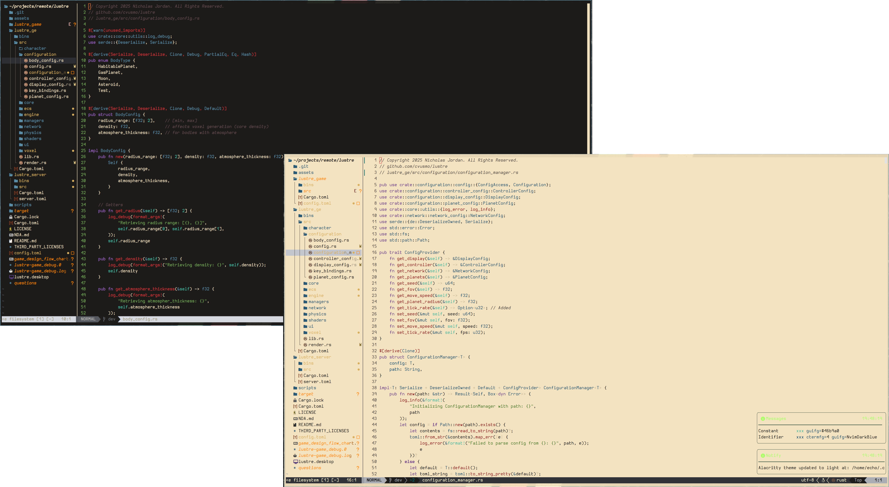

<a href="https://dotfyle.com/blacksheepcosmo/blackbeard-nvim-lua-blackbeard"></a>
<a href="https://dotfyle.com/blacksheepcosmo/blackbeard-nvim-lua-blackbeard"></a>
<a href="https://dotfyle.com/blacksheepcosmo/blackbeard-nvim-lua-blackbeard"></a>

# blackbeard.nvim

**blackbeard.nvim** is a modern, customizable Neovim color scheme designed for productivity. Heavily inspired by TokyoNight, Kanagawa, Cyberdream, and Gruvbox. blackbeard-nvim is in it's early life. Palette and finetuning will come. User feedback is appreciated.

## Preview



[Watch the blackbeard-nvim on YouTube](https://www.youtube.com/watch?v=VgWiPCSRz7g)


## Features

- Dark and Light themes inspired by popular colorschemes like Gruvbox, Kanagawa, TokyoNight, and Cyberdream
- Integration with popular plugins such as Telescope, LSP, and more.

## Installation

# :black_heart: Blackbeard-nvim Plugin Update: Easy Installation with Lazy.nvim

Hey everyone! I’ve been working on my dotfiles and recently branched off my `blackbeard-nvim` plugin to add some cool features. It’s a simple Neovim plugin for toggling between dark and light themes, and it’s super easy to install using Lazy.nvim (note: this doesn’t work with Packer). Follow the steps below to get started! :rocket:

## Installation Instructions

1. **Visit the GitHub Repository**  
   Head over to the `blackbeard-nvim` repository:  
   [https://github.com/cvusmo/blackbeard-nvim](https://github.com/cvusmo/blackbeard-nvim)

2. **Add the Plugin to Your Neovim Config**  
   Open your Neovim configuration directory (usually `~/.config/nvim/`). If you don’t already have a `plugins` directory for Lazy.nvim, create one:  

```bash
mkdir -p ~/.config/nvim/lua/plugins
```

3.Create or Edit the Plugin File
Create (or edit) a file named blackbeard.lua in the ~/.config/nvim/lua/plugins/ directory:  
bash

touch ~/.config/nvim/lua/plugins/blackbeard.lua

4. Add the Plugin Configuration
Copy the following Lua code into ~/.config/nvim/lua/plugins/blackbeard.lua. This sets up the plugin with the default dark theme and adds a keybinding to toggle between dark and light themes:  

``` lua
-- ~/.config/nvim/lua/plugins/blackbeard.lua

return {
  "cvusmo/blackbeard-nvim",
  config = function()
    require("blackbeard").setup({
      theme = "dark", -- Default theme: "dark" or "light"
    })

    -- Function to toggle between dark and light themes
    local function toggle_theme()
      local current_theme = require("blackbeard").config.theme
      local new_theme = current_theme == "dark" and "light" or "dark"
      vim.cmd("BlackbeardTheme " .. new_theme)
    end

    -- Keybinding to toggle the theme
    vim.keymap.set("n", "<leader>tt", toggle_theme, { desc = "Toggle Blackbeard theme (dark/light)" })
  end,
}
```

5. Sync Plugins with Lazy.nvim
Open Neovim and run the following command to install the plugin:  

```
:Lazy sync
```

6. This will download and install blackbeard-nvim from the master branch.
Test the Plugin  

    Restart Neovim 
    Press <leader>tt (e.g., if your leader key is the default \, this would be \tt) to toggle between the dark and light themes.  
    Or enter command :BlackbeardTheme dark OR :BlackbeardTheme light
    You should see your Neovim colorscheme switch between the two themes!

---

### Acknowledgements
Thank you to all who have created colorschmes for neovim. These four have been some of my favorites to use and their code was instrumental in setting up my own colorscheme. Thank you again!

- [Kanagawa](https://github.com/rebelot/kanagawa.nvim)
- [Cyberdream](https://github.com/scottmckendry/cyberdream.nvim)
- [Tokyonight](https://github.com/folke/tokyonight.nvim)
- [Gruvbox](https://github.com/morhetz/gruvbox)

### Support Me

## Donate


- Don't buy me a coffee. [Donate](https://www.twitch.tv/charity/cvusmo) To Write Love on Her Arms is a nonprofit movement dedicated to presenting hope and finding help for people struggling with depression, addiction, self-injury, and suicide. TWLOHA exists to encourage, inform, inspire, and invest directly into treatment and recovery. To Write Love on Her Arms before subscribing. I would rather any amount of $ go to helping someone get the help they need, than to me.

## Twitch
- I stream Weds-Sun on [twitch](https://www.twitch.tv/cvusmo) from 05:00 EST to 11:00 AM EST. Come hang out in chat, and let me know what you're working on! All active subscribers will be added to credits for Lustre game engine and other software I develop.

## Youtube
- [youtube](https://www.youtube.com/@cvusmo) Not as active as I used to be but plan on uploading Rust/Lua related content starting January 2025. Help me reach monetization by simply subscribing to the channel. Leave a comment and let me know what you'd be interested in. I plan on going through creating this blackbeard-nvim as a series. Then diving into Rust related projects to show how to create basic applications.

## x
- [x](https://www.x.com/cvusmo) Follow on x for more of day to day memes, random thoughts, and spicy fresh hot takes.
